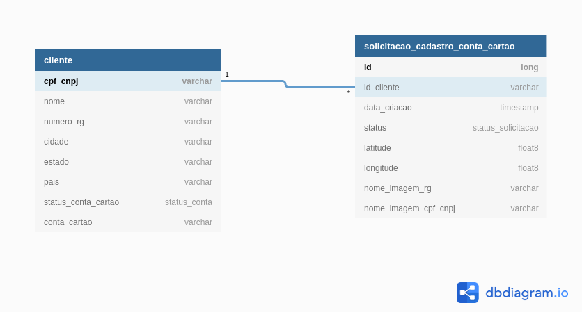

# Sistema_Cadastro_Conta_Cartao
Serviço para cadastro de Contas Cartão de Clientes. Realiza Cadastro e análises de Documentos, Fraude e Crédito.

## Compilação e Execução

### Dependências

Todos os módulos foram implementados como aplicações Java utilizando o framework SpringBoot. Os projetos tem as seguintes dependências:

- [Java 8](https://www.java.com/pt_BR/download/)
- [Maven](https://maven.apache.org/)
- [Kakfa](https://kafka.apache.org/)

### Compilação

O Maven é utilizado na compilação dos módulos. Execute o seguinte comando: 

`mvn package`

### Teste 

Foram escritos testes unitários para o Microserviço de Cadastro de Clientes. Para executá-los:

`mvn test`

### Execução 

Para execução de qualquer um dos módulos execute o comando:

`mvn spring-boot:run`

Os endpoints do Microserviço de Cadastro de Clientes foram documentados utilizando o [Swagger](https://swagger.io/).
A documentação do swagger está localizada em `Cadastro_Cliente/src/main/resources/swagger.yaml`, use o [Swagger Editor](https://editor.swagger.io/) para visualizá-la. 

## Definições

Cada um dos microserviços propostos foi construído utilizando a linguagem de programação Java e o framework SpringBoot. O Microserviço de Cadastro de Cliente foi criado como uma API REST, expondo endpoints para cadastro e gestão de clientes e solicitações de cadastro de contas cartão, ele utiliza um banco de dados em memória (H2) para armazenar os dados. O modelo de dados criado no banco de dados é o apresentado na Figura a seguir:

O modelo é bem simples, temos as entidades cliente e solicitacao_cadastro_conta_cartao que armazenam os dados necessários para os demais módulos de análise. A única relação existente é a de 1 para Muitos entre o cliente e as solicitações de cadastro de conta cartão feitas por ele. Uma regra implementada é que o cliente só pode realizar novas requisições de cadastro caso a última solicitação feita por ele seja rejeitada, caso ainda exista uma solicitação com análise pendente ou a conta já tenha sido criada, ele não pode realizar novas solicitações.

Foi criada uma instalação local do Apache Kafka (instruções para instalação no [link](https://tecadmin.net/install-apache-kafka-ubuntu/})) com 4 tópicos:

- cadastro-conta-cartao-analise-documentos-topic: Armazena as mensagens de comunicação entre os Microserviços de Cadastro de Cliente e de Análise de Documentos.
- cadastro-conta-cartao-analise-fraude-topic: Armazena as mensagens de comunicação entre os Microserviços de Análise de Documentos e de Análise de Fraude.
- cadastro-conta-cartao-analise-credito-topic: Armazena as mensagens de comunicação entre os Microserviços de Análise de Fraude e de Análise de Crédito.
- cadastro-conta-cartao-comunicacoes-topic: Armazena as mensagens para envio de comunicações ao cliente provenientes dos demais módulos de análise. 

Os Microserviços de Análise de Documentos e Análise de Crédito não tem lógica de análise implementada, eles apenas reagem a novas mensagens nos tópicos, gerando mensagens e requisições de sucesso e falha de maneira aleatória. O Microserviço de Análise de Fraude implmenta uma regra de simples, ele valida se a média das distâncias entre a localidade da solicitação atual e as solicitações da última semana ultrapassa 1000 km, identificando uma fraude nessas situações. O Microserviço Comunicador reage às mensagens enviadas em seu tópico emulando uma consulta ao DynamoDB para obter a mensagem correta para o tipo de comunicação, e exibindo essa mensagem na saída padrão.

### Melhorias

Identifico as seguintes melhorias no projeto implementado:

- Criação de testes unitários para os Microserviços de Análise Documentos, Fraude, Crédito e Comunicador.
- Uso da validação de testes de mutação em todos os Microserviços ([PitTest](https://pitest.org}))
- Uso do OAUTH2 e de tokens JWT para controle do acesso aos endpoints do Microserviço de Cadastro de Clientes.
